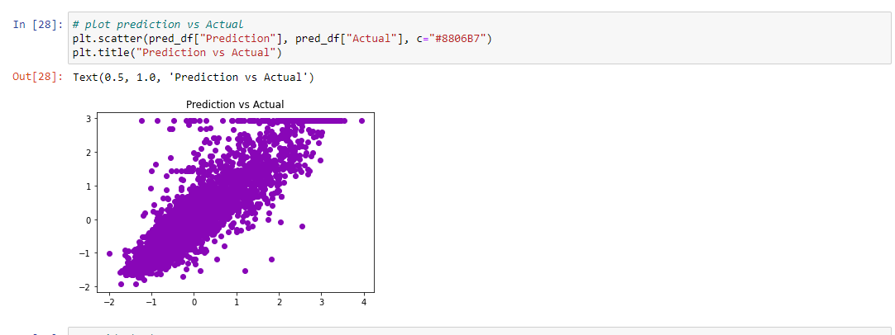

# project3_challenge

## By Tony Zhao 27/05/2021

### Data source:
   sklearn.datasets.fetch_california_housing
   
### subject : Machine Learning analysis and visualization California_Housing_Database

* Details: It will include each possible regression ML model and predict for the targets;
             Visualize the medium income vs HouseAge, AveRooms, AveBedrms, Population etc.
             Data visualization to deploy Tableau, matplotlib, leaflet, plotly and D3 etc . 
             
### Machine Learning operations
**Outliers Check:**

**Prediction vs Actual:**

**Machine Learning Residual Plot:**

             
### Final HTML and some pages:
**Home Page:**

**Rich Area:**

**House Value VS Income:**

**House Age VS Income:**

**Thank you:**

# Job done details

* The following tools deployed : Pandas, Matplotlib, 6 machine learning models, HTML, CSS, Tableau, Javascript etc.
* Data has been thoroughly checked, all main statistics parameters calculated, all variables correlation matrix conducted, outliers calculated and recorded. However the outliers are found too many more than 1000 rows, so did not deleted before analysis.
* Machine learning operation done and predictions made, with best R2 score 0.84 achieved.
* 15 visualizations made for the data story telling.
* Finally the visualization hosted by:
    github link : https://tonyzhao668.github.io/project3_challenge/
    Tableau link: https://public.tableau.com/views/Project3_16217549970120/Story1  
        
### Job Schedule:
* 22/05/2021 proposal submit;
* 24/05/2021 data pre_processing ready;
* 26/05/2021 data processing finish;
* 28/05/2021 data visualization to be tested;
* 30/05/2021 data visualization finally tuned;
* 01/06/2021 presentation slides ready;
* 03/06/2021 final check;
* 05/06/2021 final presentation.

### Thank you for review and comments.